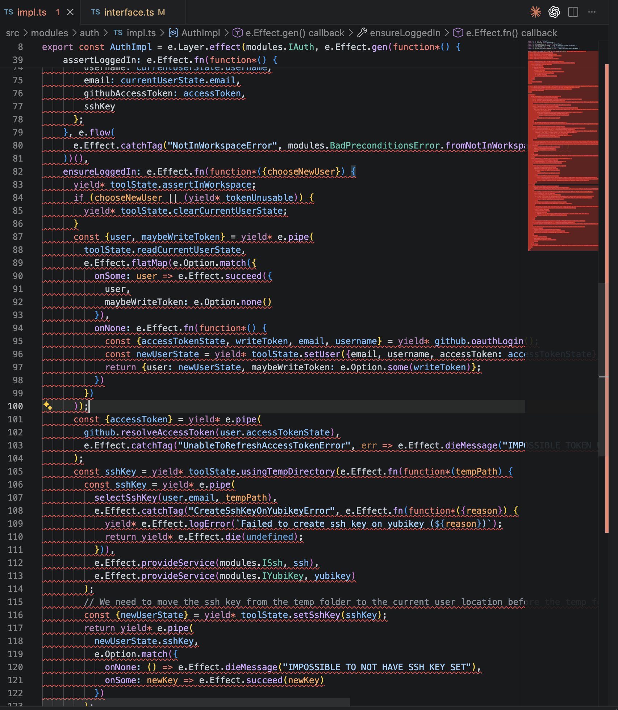
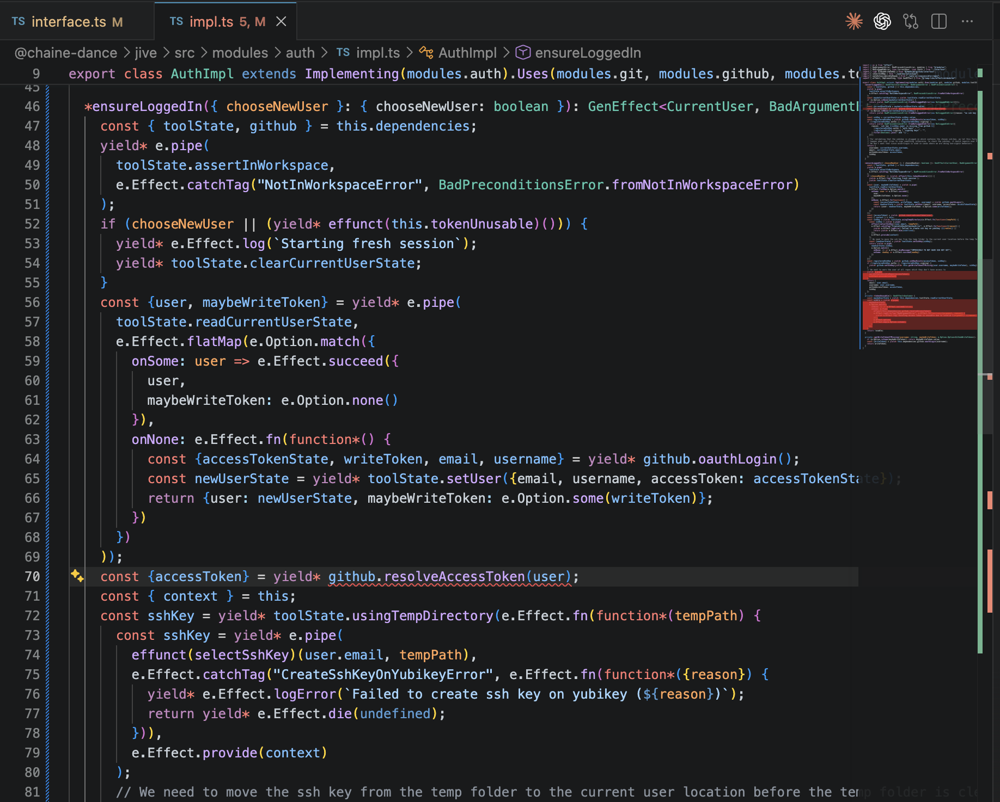

(Note: this article assumes familiarity with TypeScript, Effect, and [SOLID](https://en.wikipedia.org/wiki/SOLID)).  
To jump straight to the tool I built, [click here](#module-declaration).

Since late 2025, I've been moving all my personal projects over to Effect, along with several work projects at Flexport (before getting laid off a couple months ago). I've come to largely agree with the premise that Effect is

> the missing TypeScript standard library

- [algebraic data types](https://doc.rust-lang.org/std/keyword.enum.html)
- [return types encoding error information](https://doc.rust-lang.org/std/result/index.html)
- [exhaustive pattern matching](https://doc.rust-lang.org/book/ch06-02-match.html)
- [first-class dependency injection](https://www.reddit.com/r/react/comments/1njcicg/comment/neunray/?utm_source=share&utm_medium=web3x&utm_name=web3xcss&utm_term=1&utm_content=share_button)
- [type-safe schema decoding](http://zod.dev/)

In 2026, serious developers who understand the value of a strongly-typed language consider all these table stakes for a robust, type-safe programming platform. All these are missing from vanilla TypeScript. A comprehensive standard library *should* include all these features, and Effect has done it for the TypeScript ecosystem, arguably *outdoing* the ecosystem alternatives on every front. Effect has brought DI into the type system. That is, there is a **compile-time failure** when required dependencies aren't provided. In general, few DI systems across all major programming languages offer this highest level of correctness.

So, Effect seems like the right choice for writing TypeScript at scale. However, as I adopt Effect conventions and constructs such as `Service`, `Context`, and `Layer` across my projects, I keep running into the same awkward developer experiences.

## Headaches

#### 1. Decoupling Impl from Interface

In Effect v3, we are [encouraged](https://effect.website/docs/requirements-management/layers/#simplifying-service-definitions-with-effectservice) to use the `Effect.Service` utility to improve code succinctness. Provide a default implementation of a `Service` and its interface gets inferred.

```ts twoslash
import { Effect } from "effect";
import { FileSystem } from "@effect/platform";
import { NodeFileSystem } from "@effect/platform-node"

class Cache extends Effect.Service<Cache>()("app/Cache", {
  // Define how to create the service
  effect: Effect.gen(function* () {
    const fs = yield* FileSystem.FileSystem;
    const lookup = (key: string) => fs.readFileString(`cache/${key}`);
    return { lookup } as const;
  }),
  // Specify dependencies
  dependencies: [NodeFileSystem.layer]
}) {}


Effect.gen(function*() {
    const cache = yield* Cache;
    yield* cache.lookup("some key");
    //           ^?
});
```

While this does improve readability (compared to declaring the `Tag` and `Layer` separately), the trade-off is violation of a sacred SOLID pillar, the [Dependency Inversion principle](https://en.wikipedia.org/wiki/Dependency_inversion_principle), which mandates that maintainable code ought to depend on abstractions, not concretions. If a bug is introduced into the implementation, a compiler error should ideally appear *in* the implementation block and the interface should not change. But with `Effect.Service` an error may instead appear in client code because changing the implementation might inadvertently also change the interface.

```ts twoslash
// @errors: 2551
import { Effect } from "effect";
import { FileSystem } from "@effect/platform";
import { NodeFileSystem } from "@effect/platform-node"
// ---cut---
class Cache extends Effect.Service<Cache>()("app/Cache", {
  effect: Effect.gen(function* () {
    const fs = yield* FileSystem.FileSystem;
    // Accidentally changed the spelling of "lookup" to "lockup"
    const lockup = (key: string) => fs.readFileString(`cache/${key}`);
    //    ^^^^^^
    return { lockup } as const;
  }),
  dependencies: [NodeFileSystem.layer]
}) {}

Effect.gen(function*() {
    const cache = yield* Cache;
    yield* cache.lookup("some key");
});
```

I deem Effect v3's `Effect.Service` an anti-pattern, but if it's so problematic why was it introduced at all?

#### 2. Awkward Interface Syntax

`Effect.Service` was introduced because the right way to do things *sucks*. In Effect, declaring an interface (`Tag`) looks like this

```ts twoslash
// @errors: 2507 2558
import { Effect, Context } from "effect";
import { PlatformError } from "@effect/platform/Error";
// ---cut---
type ICache = {
  lookup(key: string): Effect.Effect<string, PlatformError, never>
}

class Cache extends Context.Tag<Cache, ICache>("app/Cache") {}
```

Oh wait no it's

```ts twoslash
// @errors: 2558 2554
import { Effect, Context } from "effect";
import { PlatformError } from "@effect/platform/Error";
type ICache = {
  lookup(key: string): Effect.Effect<string, PlatformError, never>
}
// ---cut---
class Cache extends Context.Tag<Cache, ICache>()("app/Cache") {}
```

Still not it. Maybe

```ts twoslash
import { Effect, Context } from "effect";
import { PlatformError } from "@effect/platform/Error";
type ICache = {
  lookup(key: string): Effect.Effect<string, PlatformError, never>
}
// ---cut---
class Cache extends Context.Tag("app/Cache")<Cache, ICache>() {}
```

there we go.

... this syntax is hieroglyphic. When defining a new `Tag` I typically fight with the compiler for a minute or so because the syntax just doesn't commit to memory. It's repetitive and cluttered.
- Why am I creating a class?
- Why am I passing the class in as a parameter?
- Why am I repeating the name of my interface 5 times?
- What are all these function calls for?

There are, as one might expect, reasonably good answers to these questions. 
- Effect needs a way to uniquely identify a `Tag` at compile time such that two `Tag`s with overlapping shapes can't be mistakenly substituted for one another due to structural typing. Effect solves this with the `key` field being preserved in the type structure. In this case `app/Cache` is the unique string. 
- Classes are both compile time and runtime entities so by declaring `Cache` as the `Tag` then passing it in as a generic for the `Self` type, it can be used as both a compile time reference to the `Tag` in `Effect` requirements channels (e.g. `Effect<void, never, Cache>`) and in runtime code when acquiring the dependency (e.g. `yield* Cache`).

For such a high cost in syntax complexity, `Tag` still leaves much to be desired. For instance, using string literals is not a foolproof way to guarantee `Tag` uniqueness. Ideally Effect would [use nominal types](https://michalzalecki.com/nominal-typing-in-typescript/#approach-1-class-with-a-private-property) for that. By adding a private field to every class declared using the `Tag()` method, we could accomplish this:

:::compare
```ts twoslash
import { PlatformError } from "@effect/platform/Error";
import {Context, Effect} from "effect";
interface ICache {
  lookup(key: string): Effect.Effect<string, PlatformError, never>
}
// ---cut---
class Cache extends Context.Tag("app/Cache")
  <Cache, ICache>() {}
// Imagine we accidentally create another tag with the same name
class Cache2 extends Context.Tag("app/Cache")
  <Cache2, ICache>() {}

const program: Effect.Effect<void, never, Cache> = Effect.gen(function*() {
  // No compiler error?! This shouldn't be allowed!
  yield* Cache2;
});
```
```ts twoslash
// @errors: 2322 2304
import { PlatformError } from "@effect/platform/Error";
import {Context, Effect} from "effect";
interface ICache {
  lookup(key: string): Effect.Effect<string, PlatformError, never>
}
// ---cut---
class Cache extends Context.Tag("app/Cache")
  <Cache, ICache>() {private nominal = true;}
class Cache2 extends Context.Tag("app/Cache")
  <Cache2, ICache>() {private nominal = true;}

const program: Effect.Effect<void, never, Cache> = Effect.gen(function*() {
  // Now we get an error. That's better
  yield* Cache2;
});
```
:::

but this would make the syntax even nastier.

All this to say, Effect's v3 `Tag` and v4 `Service` utilities had me missing the simplicity of pure interfaces and wondering if it might be possible to get the properties Effect is aiming for without the unreadable and repetitive syntax.

#### 3. Error Noise

This biggest headache I experience, by far, when working with Effect is my IDE becoming *unusable* whenever I introduce a bug into an effect implementation that changes its error or requirements channel. This happens a lot during refactors, especially when work on one service leads me to refactor the contract (interface) of another.

In this example from one of my own projects, this is what happens when I change the type signature of the `github` service's `resolveAccessToken` method so that it has an additional requirement such that it no longer matches  `ensureLoggedIn`'s requirements channel:



Seeing the whole `Layer` implementation light up as incorrect is not conducive to productively finding and fixing the bug. Ideally only the `resolveAccessToken` line would be highlighted as wrong, prompting me to `provide` a `Context` with the required `Service` to that `Effect`.

When one runs into this kind of issue frequently, it becomes tempting to start taking the path of least resistance. That often looks like handling all possible errors after the entire `Effect`'s body rather than handling each error at the line which produces it; over time these kinds of shortcuts lead to brittle and confusing code.

#### 4. Verbose Dependency Passing

Building on that `resolveAccessToken` example, when you want to yield an `Effect` which depends on 1+ services you need to either define that `Effect` within the `Layer`'s closure so the services yielded at layer construction time are in scope, or you need to create a custom `Context` and `provide` it to the `Effect` before yielding.

Here's an example of that first option

```ts twoslash
import { Effect, Context, Layer } from "effect";
// ---cut---
class ServiceOne extends Context.Tag("ServiceOne")<ServiceOne, {
  serviceOneMethod(someInput: number): Effect.Effect<string, never, never>;
}>() {};

class ServiceTwo extends Context.Tag("ServiceTwo")<ServiceTwo, {
  serviceTwoMethod(someInput: number): Effect.Effect<string, never, never>; 
}>() {};

const ServiceTwoImpl = Layer.effect(ServiceTwo, Effect.gen(function*() {
  const serviceOne = yield* ServiceOne;
  const helperFn = Effect.fn(function*(someInput: number) {
    //  ^?
    // By placing helperFn inside the layer, it can access serviceOne directly
    const serviceOneResult = yield* serviceOne.serviceOneMethod(someInput);
    // Do something complex with result before returning it.
    const complexResult = serviceOneResult;
    return complexResult;
  });
  return {
    serviceTwoMethod: Effect.fn(function*(someInput) {
      return yield* helperFn(someInput);
    })
  }
}));
```

And here's option two

```ts twoslash
import { Effect, Context, Layer, pipe } from "effect";

class ServiceOne extends Context.Tag("ServiceOne")<ServiceOne, {
  serviceOneMethod(someInput: number): Effect.Effect<string, never, never>;
}>() {};

class ServiceTwo extends Context.Tag("ServiceTwo")<ServiceTwo, {
  serviceTwoMethod(someInput: number): Effect.Effect<string, never, never>; 
}>() {};
// ---cut---
const helperFn = Effect.fn(function*(someInput: number) {
  //  ^?
  const serviceOne = yield* ServiceOne;
  const serviceOneResult = yield* serviceOne.serviceOneMethod(someInput);
  // Do something complex with result before returning it.
  const complexResult = serviceOneResult;
  return complexResult;
});

const ServiceTwoImpl = Layer.effect(ServiceTwo, Effect.gen(function*() {
  const serviceOne = yield* ServiceOne;
  // We have to manually create this Context then provide it to the helper function
  const context = pipe(
    Context.empty(),
    Context.add(ServiceOne, serviceOne)
  );
  return {
    serviceTwoMethod: Effect.fn(function*(someInput) {
      // Because helperFn lives outside the impl, we have to pass a context or
      // eject from DI entirely and pass all services as function params
      return yield* helperFn(someInput).pipe(Effect.provide(context));
    })
  }
}));
```

As we get into 5+ services territory the code for specifying dependencies and adding them all to a reusable context starts to smell like unnecessary boilerplate.

```ts
const serviceOne = yield* ServiceOne;
const serviceTwo = yield* ServiceTwo;
const serviceThree = yield* ServiceThree;
const serviceFour = yield* ServiceFour;
const serviceFive = yield* ServiceFive;
const context = e.pipe(
  e.Context.empty(),
  e.Context.add(ServiceOne, serviceOne),
  e.Context.add(ServiceTwo, serviceTwo),
  e.Context.add(ServiceThree, serviceThree),
  e.Context.add(ServiceFour, serviceFour),
  e.Context.add(ServiceFive, serviceFive)
)
```

*This* is what we're calling state-of-the-art TypeScript in 2026?

#### 5. Confusing Naming Conventions

Lastly, I've always been bothered by Effect's use of the term "service". To me, "service" alludes to some outside entity which my code can invoke via some network call, but in Effect a service is basically a singleton instance which encapsulates some common internal logic. "Tag" is also confusing compared to a well-known term like "interface". I'm aware that Effect is following conventions established by other DI frameworks like [ZIO](https://zio.dev/reference/di/) or [Angular](https://angular.dev/guide/di#what-are-services), but from my POV defaults should be sensible and names [shouldn't be surprising](https://en.wikipedia.org/wiki/Principle_of_least_astonishment).

## Effective Modules

All these headaches had me searching for ways to make Effect feel more self-explanatory and intuitive. Effect seems to be creating the right set of foundational primitives for building production-grade TypeScript, so it seems worthwhile to invest in making these primitives feel good to work with.

Enough experimentation eventually led to something packageable as its own library. I'm calling it [Effective Modules](https://github.com/ozyman42/effective-modules). Perhaps some of these ideas / patterns might make their way into Effect core and or the canonical docs/examples at some point? Let me know what you think.

#### Effective?

I'm coining the word "Effective" here to mean idiomatic, elegant Effect code. "Effective" is to Effect as ["Pythonic"](https://www.reddit.com/r/learnprogramming/comments/1ps61gp/what_exactly_does_pythonic_mean_and_how_can_i/) is to Python. Not to be confused with ["Effectful"](https://idiomaticsoft.com/post/2024-01-02-effect-systems/).

#### Modules?

Modules is my word of choice over "tag" or "service". Module typically refers to some group of encapsulated code which is internal to a project. Module also implies a grouping of related functionality, and when [Uncle Bob first described the Dependency Inversion Principle](https://ebooks.karbust.me/Technology/Agile.Software.Development.Principles.Patterns.and.Practices.Pearson.pdf#:~:text=Somebody%20has%20to%20create%20the%20instances%20of%20the%20concrete%20classes,%20and%20whatever%20module%20does%20that%20will%20depend%20on%20them) he used "class" and "module" interchangeably when referring to code building blocks that depend on each other. The wiki article on DIP [does this too](https://en.wikipedia.org/wiki/Dependency_inversion_principle#:~:text=modules%20should%20not%20import%20anything%20from).

I confess to substituting one overloaded term for another with "modules"
- folders or files can be called modules (e.g. [ES Modules](https://developer.mozilla.org/en-US/docs/Web/JavaScript/Guide/Modules) or [Rust modules](https://doc.rust-lang.org/rust-by-example/mod/split.html))
- libraries can be modules (e.g. [Go Modules](https://go.dev/blog/using-go-modules))
- modules can simply mean a group of code (e.g. [NestJS modules](https://docs.nestjs.com/modules))

Despite the phrase's frequent use, the commonality here is that "module" in all these cases refers to code that's internal, encapsulated, and logically grouped under a namespace. To me, that's a more sensible fit than "service". I'd love to see a rebuttal.

#### Module Declaration

With Effective Modules, we return to the plain interface.

:::compare
```ts twoslash
import { Context, Data, Effect } from "effect";
class BadSignature extends Data.TaggedError("BadSignature")<{}> {}
// ---cut---
class Users extends Context.Tag("Users")<
  Users,
  {
    createUser(
      username: string,
      signature: string
    ): Effect.Effect<{token: string}, BadSignature>;
    
    authenticate(
      username: string,
      signature: string
    ): Effect.Effect<{token: string}, BadSignature>;
  }
>() {}
```

```ts twoslash
import { Data, Effect } from "effect";
class BadSignature extends Data.TaggedError("BadSignature")<{}> {}
// ---cut---
interface IUsers {
  createUser(
    username: string,
    signature: string
  ): Effect.fn.Return<{token: string}, BadSignature>;
  
  authenticate(
    username: string,
    signature: string
  ): Effect.fn.Return<{token: string}, BadSignature>;
}
```
:::

`Tag`s (`Service`s in v4) are created by mapping each module name to an interface.

```ts twoslash
import { Data, Effect, Option } from "effect";

class BadSignature extends Data.TaggedError("BadSignature")<{}> {}
class InvalidToken extends Data.TaggedError("InvalidToken")<{}> {}
class NoSuchTask extends Data.TaggedError("NoSuchTask")<{}> {}

interface IUsers {
  createUser(username: string, signature: string): Effect.fn.Return<{token: string}, BadSignature>;
  authenticate(username: string, signature: string): Effect.fn.Return<{token: string}, BadSignature>;
}

interface ITodos {
  getTasks(token: string): Effect.fn.Return<{task: string; id: string;}[], InvalidToken>
  createTask(token: string, task: string): Effect.fn.Return<{task: string; id: string;}, InvalidToken>
  completeTask(token: string, id: string): Effect.fn.Return<void, NoSuchTask | InvalidToken>;
}

interface IDatabase {
  get(key: string): Effect.fn.Return<Option.Option<string>>;
  set(key: string, value: string): Effect.fn.Return<void>;
}
// ---cut---
import { interfaces } from "effective-modules";

export enum Modules {
  Users = "Users",
  Todos = "Todos",
  Database = "Database"
}

export const modules = interfaces<Modules, {
  Users: IUsers;
  Todos: ITodos;
  Database: IDatabase;
}>(Modules);

modules;
//^?
```

The string enum members are used as the `Tag`s' `Self` and `key` types, bypassing the need for the cluttered class syntax [mentioned earlier](#2-awkward-interface-syntax) since string enum members are similarly both a runtime value and a type. This method of creating `Tag`s is also a more correct means of ensuring uniqueness since string enum members are nominal types, meaning TypeScript will treat two Effective Modules with the same name as distinct. No fancy private property tricks necessary.

```ts twoslash
// @errors: 2322 1005
import { Effect } from "effect";
import { interfaces } from "effective-modules";
// ---cut---
enum ModuleSetOne {
  Users = "Users",
  Database = "Database"
}

const moduleSetOne = interfaces<ModuleSetOne, {
  Users: {};
  Database: {};
}>(ModuleSetOne);

enum ModuleSetTwo {
  Users = "Users",
  Database = "Database"
}

const moduleSetTwo = interfaces<ModuleSetTwo, {
  Users: {};
  Database: {};
}>(ModuleSetTwo);

function* program(): Effect.fn.Return<void, never, ModuleSetTwo.Users> {
  yield* moduleSetTwo.Users;
  // A compiler error, as there should be.
  yield* moduleSetOne.Users;
}
```

We'll dive into this [a bit more later](#precise-error-location), but notice how we've managed to get an error at a specific line rather than the [entire generator function being marked as incorrect](#3-error-noise). This is achieved by explicitly typing the return of the generator function using `Effect.fn.Return` rather than using the prescribed `Effect.gen` or `Effect.fn` + anon generator function.

#### Module Implementation

In Effective Modules, you create a class which implements an interface.

:::compare
```ts twoslash
import { Data, Effect, Option, Layer } from "effect";

class BadSignature extends Data.TaggedError("BadSignature")<{}> {}
class InvalidToken extends Data.TaggedError("InvalidToken")<{}> {}
class NoSuchTask extends Data.TaggedError("NoSuchTask")<{}> {}

interface IUsers {
  login(username: string, signature: string): Effect.Effect<{token: string}, BadSignature>;
  validateToken(token: string): Effect.fn.Return<Option.Option<{username: string}>>;
}

interface ITodos {
  getTasks(token: string): Effect.Effect<{task: string; id: string;}[], InvalidToken>
  createTask(token: string, task: string): Effect.Effect<{task: string; id: string;}, InvalidToken>
  completeTask(token: string, id: string): Effect.Effect<void, NoSuchTask | InvalidToken>;
}

interface IDatabase {
  getAll(table: string, username: string): Effect.Effect<{key: string, value: string}[]>;
  get(table: string, username: string, key: string): Effect.fn.Return<Option.Option<string>>;
  set(table: string, username: string, value: string, key?: string): Effect.fn.Return<{key: string}>;
  delete(table: string, username: string, key: string): Effect.fn.Return<void>;
}

import { interfaces } from "effective-modules";

export enum Modules {
  Users = "Users",
  Todos = "Todos",
  Database = "Database"
}

export const { Users, Todos, Database } = interfaces<Modules, {
  Users: IUsers;
  Todos: ITodos;
  Database: IDatabase;
}>(Modules);
// ---cut---
export const TodosLive = Layer.effect(
  Todos,
  Effect.gen(function*() {
    const users = yield* Users;
    const db = yield* Database;
    const TASKS_TABLE = "tasks";
    const validateTokenOrError = Effect.fn(function*(token: string) {
      const maybeUsername = yield* users.validateToken(token);
      if (Option.isNone(maybeUsername)) {
        return yield* new InvalidToken();
      }
      return maybeUsername.value.username;
    });
    return {
      getTasks: Effect.fn(function*(token) {
        const username = yield* validateTokenOrError(token);
        const items = yield* db.getAll(TASKS_TABLE, username);
        return items.map(({key, value}) => ({id: key, task: value}));
      }),
      createTask: Effect.fn(function*(token, task) {
        const username = yield* validateTokenOrError(token);
        const { key } = yield* db.set(TASKS_TABLE, username, task);
        return {id: key, task};
      }),
      completeTask: Effect.fn(function* (token, id) {
        const username = yield* validateTokenOrError(token);
        const exists = Option.isSome(yield* db.get(TASKS_TABLE, username, id));
        if (!exists) return yield* new NoSuchTask();
        yield* db.delete(TASKS_TABLE, username, id);
      })
    };
  })
)

TodosLive
// ^?
```

```ts twoslash
import { Data, Effect, Option, Layer } from "effect";

class BadSignature extends Data.TaggedError("BadSignature")<{}> {}
class InvalidToken extends Data.TaggedError("InvalidToken")<{}> {}
class NoSuchTask extends Data.TaggedError("NoSuchTask")<{}> {}

interface IUsers {
  login(username: string, signature: string): Effect.fn.Return<{token: string}, BadSignature>;
  validateToken(token: string): Effect.fn.Return<Option.Option<{username: string}>>;
}

interface ITodos {
  getTasks(token: string): Effect.fn.Return<{task: string; id: string;}[], InvalidToken>
  createTask(token: string, task: string): Effect.fn.Return<{task: string; id: string;}, InvalidToken>
  completeTask(token: string, id: string): Effect.fn.Return<void, NoSuchTask | InvalidToken>;
}

interface IDatabase {
  getAll(table: string, username: string): Effect.fn.Return<{key: string, value: string}[]>;
  get(table: string, username: string, key: string): Effect.fn.Return<Option.Option<string>>;
  set(table: string, username: string, value: string, key?: string): Effect.fn.Return<{key: string}>;
  delete(table: string, username: string, key: string): Effect.fn.Return<void>;
}

import { interfaces } from "effective-modules";

export enum Modules {
  Users = "Users",
  Todos = "Todos",
  Database = "Database"
}

export const {Users, Todos, Database} = interfaces<Modules, {
  Users: IUsers;
  Todos: ITodos;
  Database: IDatabase;
}>(Modules);
// ---cut---
import { implementing } from "effective-modules";

export class TodosImpl extends implementing(Todos).uses(Database, Users) implements ITodos {
  private static readonly TASKS_TABLE = "tasks";

  *getTasks(token: string): Effect.fn.Return<{ task: string; id: string; }[], InvalidToken> {
    const username = yield* this.validateTokenOrError(token);
    const items = yield* this.dependencies.Database.getAll(
      TodosImpl.TASKS_TABLE, username
    );
    return items.map(({key, value}) => ({id: key, task: value}));
  }

  *createTask(token: string, task: string): Effect.fn.Return<{ task: string; id: string; }, InvalidToken> {
    const username = yield* this.validateTokenOrError(token);
    const { key } = yield* this.dependencies.Database.set(
      TodosImpl.TASKS_TABLE, username, task
    );
    return {id: key, task};
  }

  *completeTask(token: string, id: string): Effect.fn.Return<void, NoSuchTask | InvalidToken> {
    const username = yield* this.validateTokenOrError(token);
    const exists = Option.isSome(yield* this.dependencies.Database.get(
      TodosImpl.TASKS_TABLE, username, id
    ));
    if (!exists) return yield* new NoSuchTask();
    yield* this.dependencies.Database.delete(
      TodosImpl.TASKS_TABLE, username, id
    );
  }

  private *validateTokenOrError(token: string): Effect.fn.Return<string, InvalidToken> {
    const maybeUsername = yield* this.dependencies.Users.validateToken(token);
    if (Option.isNone(maybeUsername)) {
      return yield* new InvalidToken();
    }
    return maybeUsername.value.username;
  }
}

TodosImpl.Layer;
//        ^?
```
:::

The superclass `implementing(modules.Todos)` created the `dependencies` structure automatically, and IDE autocomplete for classes implementing an interface will generate method stubs so you don't need to type out the method signatures manually. Generator methods are used directly rather than wrapping in `Effect.fn` because this allows us to cleanly access `this.dependencies` and `this.context`.

#### Precise Error Location

If you get nothing else from this article take this away: explicitly annotating your generator functions with a return type of `Effect.fn.Return<A, E, R>` will enable exact error locations. This type alias ships with Effect. It represents an `Effect`  `Generator`. Effective Modules provides a `EffectGen<A, E, R>` type alias for convenience.

Here's the same `ensureLoggedIn` example [from earlier](#3-error-noise) but now we have a clear, targeted compiler error on the `resolveAccessToken` call line.



Let's see this in action in our Todo example where we'll yield an unexpected error from the `validateTokenOrError` method.

:::compare
```ts twoslash
// @errors: 2345
import { Data, Effect, Option, Layer } from "effect";

class BadSignature extends Data.TaggedError("BadSignature")<{}> {}
class InvalidToken extends Data.TaggedError("InvalidToken")<{}> {}
class NoSuchTask extends Data.TaggedError("NoSuchTask")<{}> {}

interface IUsers {
  login(username: string, signature: string): Effect.Effect<{token: string}, BadSignature>;
  validateToken(token: string): Effect.fn.Return<Option.Option<{username: string}>>;
}

interface ITodos {
  getTasks(token: string): Effect.Effect<{task: string; id: string;}[], InvalidToken>
  createTask(token: string, task: string): Effect.Effect<{task: string; id: string;}, InvalidToken>
  completeTask(token: string, id: string): Effect.Effect<void, NoSuchTask | InvalidToken>;
}

interface IDatabase {
  getAll(table: string, username: string): Effect.Effect<{key: string, value: string}[]>;
  get(table: string, username: string, key: string): Effect.fn.Return<Option.Option<string>>;
  set(table: string, username: string, value: string, key?: string): Effect.fn.Return<{key: string}>;
  delete(table: string, username: string, key: string): Effect.fn.Return<void>;
}

import { interfaces } from "effective-modules";

export enum Modules {
  Users = "Users",
  Todos = "Todos",
  Database = "Database"
}

export const {Todos, Database, Users} = interfaces<Modules, {
  Users: IUsers;
  Todos: ITodos;
  Database: IDatabase;
}>(Modules);
// ---cut---
export const TodosLive = Layer.effect(
  Todos,
  Effect.gen(function*() {
    const users = yield* Users;
    const db = yield* Database;
    const TASKS_TABLE = "tasks";
    const validateTokenOrError = Effect.fn(function*(token: string) {
      const maybeUsername = yield* users.validateToken(token);
      if (Option.isNone(maybeUsername)) {
        return yield* new InvalidToken();
      }
      if (token.length) {
        return yield* new BadSignature();
      }
      return maybeUsername.value.username;
    });
    return {
      getTasks: Effect.fn(function*(token) {
        const username = yield* validateTokenOrError(token);
        const items = yield* db.getAll(TASKS_TABLE, username);
        return items.map(({key, value}) => ({id: key, task: value}));
      }),
      createTask: Effect.fn(function*(token, task) {
        const username = yield* validateTokenOrError(token);
        const { key } = yield* db.set(TASKS_TABLE, username, task);
        return {id: key, task};
      }),
      completeTask: Effect.fn(function* (token, id) {
        const username = yield* validateTokenOrError(token);
        const exists = Option.isSome(yield* db.get(TASKS_TABLE, username, id));
        if (!exists) return yield* new NoSuchTask();
        yield* db.delete(TASKS_TABLE, username, id);
      })
    };
  })
)
```

```ts twoslash
// @errors: 2322
import { Data, Effect, Option, Layer } from "effect";

class BadSignature extends Data.TaggedError("BadSignature")<{}> {}
class InvalidToken extends Data.TaggedError("InvalidToken")<{}> {}
class NoSuchTask extends Data.TaggedError("NoSuchTask")<{}> {}

interface IUsers {
  login(username: string, signature: string): Effect.fn.Return<{token: string}, BadSignature>;
  validateToken(token: string): Effect.fn.Return<Option.Option<{username: string}>>;
}

interface ITodos {
  getTasks(token: string): Effect.fn.Return<{task: string; id: string;}[], InvalidToken>
  createTask(token: string, task: string): Effect.fn.Return<{task: string; id: string;}, InvalidToken>
  completeTask(token: string, id: string): Effect.fn.Return<void, NoSuchTask | InvalidToken>;
}

interface IDatabase {
  getAll(table: string, username: string): Effect.fn.Return<{key: string, value: string}[]>;
  get(table: string, username: string, key: string): Effect.fn.Return<Option.Option<string>>;
  set(table: string, username: string, value: string, key?: string): Effect.fn.Return<{key: string}>;
  delete(table: string, username: string, key: string): Effect.fn.Return<void>;
}

import { interfaces } from "effective-modules";

export enum Modules {
  Users = "Users",
  Todos = "Todos",
  Database = "Database"
}

export const {Todos, Database, Users} = interfaces<Modules, {
  Users: IUsers;
  Todos: ITodos;
  Database: IDatabase;
}>(Modules);
// ---cut---
import { implementing, type EffectGen } from "effective-modules";

export class TodosImpl extends implementing(Todos).uses(Database, Users) implements ITodos {
  private static readonly TASKS_TABLE = "tasks";

  *getTasks(token: string): EffectGen<{ task: string; id: string; }[], InvalidToken> {
    const username = yield* this.validateTokenOrError(token);
    const items = yield* this.dependencies.Database.getAll(
      TodosImpl.TASKS_TABLE, username
    );
    return items.map(({key, value}) => ({id: key, task: value}));
  }

  *createTask(token: string, task: string): EffectGen<{ task: string; id: string; }, InvalidToken> {
    const username = yield* this.validateTokenOrError(token);
    const { key } = yield* this.dependencies.Database.set(
      TodosImpl.TASKS_TABLE, username, task
    );
    return {id: key, task};
  }

  *completeTask(token: string, id: string): EffectGen<void, NoSuchTask | InvalidToken> {
    const username = yield* this.validateTokenOrError(token);
    const exists = Option.isSome(yield* this.dependencies.Database.get(
      TodosImpl.TASKS_TABLE, username, id
    ));
    if (!exists) return yield* new NoSuchTask();
    yield* this.dependencies.Database.delete(
      TodosImpl.TASKS_TABLE, username, id
    );
  }

  private *validateTokenOrError(token: string): EffectGen<string, InvalidToken> {
    const maybeUsername = yield* this.dependencies.Users.validateToken(token);
    if (Option.isNone(maybeUsername)) {
      return yield* new InvalidToken();
    }
    if (token.length) {
      return yield* new BadSignature();
    }
    return maybeUsername.value.username;
  }
}
```
:::

In Effect's current canon, the entire layer definition gets marked as invalid, which isn't helpful when trying to pinpoint issues.

#### context, dependencies, effunct

As mentioned before, the `implementing` utility returns an abstract superclass that provides a `dependencies` structure. The superclass also provides a `context` structure so you no longer have to [repeat yourself](#:~:text=state%2Dof%2Dthe%2Dart%20TypeScript) when passing dependencies to `Effect`s defined outside of the implementation scope. Revisiting our [earlier example](#:~:text=here's%20option%20two) we now have

:::compare
```ts twoslash
import { Effect, Context, Layer, pipe } from "effect";

class ServiceOne extends Context.Tag("ServiceOne")<ServiceOne, {
  serviceOneMethod(someInput: number): Effect.Effect<string, never, never>;
}>() {};

class ServiceTwo extends Context.Tag("ServiceTwo")<ServiceTwo, {
  serviceTwoMethod(someInput: number): Effect.Effect<string, never, never>; 
}>() {};
// ---cut---
const helperFn = Effect.fn(function*(someInput: number) {
  const serviceOne = yield* ServiceOne;
  const serviceOneResult = yield* serviceOne.serviceOneMethod(someInput);
  // Do something complex with result before returning it.
  const complexResult = serviceOneResult;
  return complexResult;
});

const ServiceTwoImpl = Layer.effect(ServiceTwo, Effect.gen(function*() {
  const serviceOne = yield* ServiceOne;
  // Need to create context manually
  const context = pipe(
    Context.empty(),
    Context.add(ServiceOne, serviceOne)
  );
  return {
    serviceTwoMethod: Effect.fn(function*(someInput) {
      return yield* pipe(
        helperFn(someInput),
        Effect.provide(context)
      );
    })
  }
}));
```
```ts twoslash
import { Effect, Context, Layer, pipe } from "effect";

interface IServiceOne {
  serviceOneMethod(someInput: number): Effect.fn.Return<string, never, never>;
}

interface IServiceTwo {
  serviceTwoMethod(someInput: number): Effect.fn.Return<string, never, never>; 
}

enum Modules {
  ServiceOne = "ServiceOne",
  ServiceTwo = "ServiceTwo"
}

import { interfaces, implementing, type EffectGen } from "effective-modules";

const modules = interfaces<Modules, {
  ServiceOne: IServiceOne;
  ServiceTwo: IServiceTwo;
}>(Modules);

// ---cut---
import { effunct } from "effective-modules";

class ServiceTwoImpl extends implementing(modules.ServiceTwo).uses(modules.ServiceOne) implements IServiceTwo {
  *serviceTwoMethod(someInput: number): EffectGen<string, never, never> {
    return yield* pipe(
      effunct(this.helperFn)(someInput),
      Effect.provide(this.context)
    );
  }

  private *helperFn(someInput: number): EffectGen<string, never, Modules.ServiceOne> {
    const serviceOne = yield* modules.ServiceOne;
    const serviceOneResult = yield* serviceOne.serviceOneMethod(someInput);
    // Do something complex with result before returning it.
    const complexResult = serviceOneResult;
    return complexResult;
  }
}
```
:::

A little less repetition, keeping the code more focused.

Something to note is a friction point that Effective Modules introduces by yielding generators directly. While directly yielding an `Effect`  `Generator` will properly return values, bubble up errors, and propagate requirements up the `Effect` call stack, the `Generator` itself is not an `Effect`, so you cannot directly `pipe` it to methods such as `Effect.provide`. Effective Modules offers the `effunct` utility to wrap generator functions such that they return an `Effect` when called. You could also just use `Effect.fn`, but `effunct` automatically passes the generator function's name into `Effect.fn`, [enabling tracing](https://effect.website/docs/error-management/expected-errors/#exporting-spans-for-tracing) (`Effect.fn(generatorFn.name)(generatorFn)`). No need to worry about binding the method before passing it into `effunct`, the `implementing` superclass takes care of that by autobinding all instance methods.

#### Custom Initializer

To allow for complex initialization behavior, one can pass a generator function to the `super` call on class construction and (optionally) add a `throws` clause to the superclass to specify an error channel.

```ts twoslash
import { Data, Effect, Context, Layer, pipe } from "effect";

interface IMyModule {
  
}

interface IOtherModule {
  
}

enum Modules {
  MyModule = "MyModule",
  OtherModule = "OtherModule"
}

import { interfaces, implementing } from "effective-modules";

const {MyModule, OtherModule} = interfaces<Modules, {
  MyModule: IMyModule;
  OtherModule: IOtherModule;
}>(Modules);

// ---cut---
import { type Initialize } from "effective-modules";

class InitializationError extends Data.TaggedError("InitializationError")<{}> {}

class MyModuleImpl extends implementing(MyModule).uses(OtherModule).throws<InitializationError>() implements IMyModule {
  constructor() {
    super(function*(): Initialize<typeof MyModuleImpl> {
      if (Math.random() > .5) {
        yield* new InitializationError();
      }
      return {
        OtherModule: yield* OtherModule
      }
    })
  }
}

MyModuleImpl.Layer
//           ^?
```

When creating a custom initializer you need to yield and return the `dependencies` object manually. There'll be a type error if any dependency specified in `uses` is missing from the returned object, or if the resulting error or requirements channel does not match what was passed to `uses` and `throws`.

```ts twoslash
// @errors: 2322
import { Data, Effect, Context, Layer, pipe } from "effect";

interface IMyModule {
  
}

interface IOtherModule {
  thing(): 2;
}

enum Modules {
  MyModule = "MyModule",
  OtherModule = "OtherModule"
}

import { interfaces, implementing } from "effective-modules";

const {MyModule, OtherModule} = interfaces<Modules, {
  MyModule: IMyModule;
  OtherModule: IOtherModule;
}>(Modules);

class UnexpectedError extends Data.TaggedError("UnexpectedError")<{}> {}

// ---cut---
import { type Initialize } from "effective-modules";

class InitializationError extends Data.TaggedError("InitializationError")<{}> {}

class MyModuleImpl extends implementing(MyModule).uses(OtherModule).throws<InitializationError>() implements IMyModule {
  constructor() {
    super(function*(): Initialize<typeof MyModuleImpl> {
      yield* MyModule;
      if (Math.random() > .5) {
        return yield* new InitializationError();
      }
      if (Math.random() > .1) {
        return yield* new UnexpectedError();
      }
      return {
        OtherModule: 2
      }
    })
  }
}
```

## Wishlist

That's basically it for Effective Modules. It's just a thin wrapper around Effect that makes your code feel a bit more sane.

Here's a list of changes I wish would land in TypeScript and Effect so Effective Modules code could be even cleaner still. 

#### `key` type in Effect Platform `Service`s

The `dependencies` object works well for services which a developer manually defines because v3's `Context.Tag` and v4's `Context.Service` creates a `ServiceClass` instance [which captures the key literal as a generic](https://github.com/Effect-TS/effect-smol/blob/ae404636ab75fc47d0167c22a20564777c12cf59/packages/effect/src/Context.ts#L84), while Effective modules uses the string enum member as both the `Self` and `key` types. But this `dependencies` construct falls apart (becomes untyped) for Effect Platform services because these extend from the base `Tag`/`Service` type which does not take in a generic `key` / `Identifier` and instead [types this field to string](https://github.com/Effect-TS/effect-smol/blob/ae404636ab75fc47d0167c22a20564777c12cf59/packages/effect/src/Context.ts#L48). For those cases Effective Modules falls back to a runtime error if the key is missing from a custom initializer return, and a `this.getDependency` utility is provided to get dependency by tag. 

```ts twoslash
// @errors: 2345
import { implementing, interfaces, type EffectGen, type Initialize } from "effective-modules";

enum Modules {
  MyModule = "MyModule",
  OtherModule = "OtherModule"
}

interface IMyModule {
  someMethod(): EffectGen<void>;
}

import { Context, Effect } from "effect";

interface INonMigratedModule {
  method(): Effect.Effect<void>;
}

const { MyModule, OtherModule } = interfaces<Modules, {
  MyModule: IMyModule;
  OtherModule: {};
}>(Modules);

// ---cut---
class NonMigratedModule extends Context.Tag("NonMigrated")<NonMigratedModule, INonMigratedModule>() {}

import { FileSystem } from "@effect/platform";

class MyModuleImpl extends implementing(MyModule).uses(FileSystem.FileSystem, NonMigratedModule) implements IMyModule {
  constructor() {
    super(function*(): Initialize<typeof MyModuleImpl> {
      /*
        No compile-time error because FileSystem["key"] is string,
        but this will cause a runtime error on Layer construction.
        In most cases I advise avoiding custom initializers so 
        Effective Modules can initialize things for you.
      */
      return {
        NonMigrated: yield* NonMigratedModule,
        // The following needs to be added to prevent runtime error
        // "@effect/platform/FileSystem": yield* FileSystem.Filesystem
      } 
    })
  }

  *someMethod(): EffectGen<void> {
    this.dependencies;
    //   ^?
    const fs = this.getDependency(FileSystem.FileSystem);
    //    ^?
    // getDependency only works for modules specified in "uses"
    this.getDependency(OtherModule);
  }
}
```

I propose that `ServiceClass` / `TagClass` become the only type for defining services. They canonically have a separate type passed in for the `Self` parameter and also track the literal for `Key`, whereas the platform services [use the same type for both `Self` and `Shape`](https://github.com/Effect-TS/effect-smol/blob/ae404636ab75fc47d0167c22a20564777c12cf59/packages/effect/src/FileSystem.ts#L714), making them susceptible to structural-typing-related bugs. That is, a service with a similar enough shape to `FileSystem` could accidentally substitute it. Ideally all service definitions have an identifying, **nominal** type and explicitly track a key literal.

If this change is too big an ask, perhaps we could at least have the Effect Platform services be subtypes of `ServiceClass` rather than the base `Service` so that they can get an explicit `key` and ideally a nominal `Self`, or perhaps move the explicit generic `key` / `Identifier` type up into the base `Service` type definition.

#### Nominal ADT enums in TypeScript

Effective Modules employed string enums for nominal `Self` types then needed a separate method to map members to an interface. Ideally though, TypeScript would offer a way to define an Abstract Data Type with nominally typed members.

:::compare
```ts
import { interfaces } from "effective-modules";

export enum Modules {
  Users = "Users",
  Todos = "Todos",
  Database = "Database"
}

export const modules = interfaces<Modules, {
  Users: IUsers;
  Todos: ITodos;
  Database: IDatabase;
}>(Modules);
```
```ts
import { interfaces } from "effective-modules";

export enum Modules {
  Users = IUsers,
  Todos = ITodos,
  Database = IDatabase
}

export const modules = interfaces(Modules);
```
:::

Is [this issue](https://github.com/microsoft/TypeScript/issues/36336) the right place to make some noise?

#### Generators AS Effects

What would be nice is if `Effect`  `Generators` could be passed around *as* `Effect`s. This would eliminate the need for syntax like `Effect.fn`, `Effect.gen`, `effunct`, `Effect.fn.Return`, etc. One could write and call pure generator functions, directly specifying the return type as an `Effect`.

:::compare
```ts
const helper: Effect<string, SomeError> = gen(function*() {
  if (someCondition)
    return yield* new SomeError();
  return "something";
});

const program: Effect<void> = gen(function*() {
  const value = yield* pipe(
    helper,
    handleSomeError
  );
  yield* log(value);
});
```
```ts
function* helper(): Effect<string, SomeError> {
  if (someCondition)
    return yield* new SomeError();
  return "something";
}

function* program(): Effect<void> {
  const value = yield* pipe(
    helper(),
    handleSomeError
  );
  yield* log(value);
}
```
:::

Which looks cleaner to you? One of the biggest complaints about Effect is how ugly it looks. I think *this* is how we address that. The after example is basically no more noisy than `async` `await` code.

#### `Abstractify` utility type in TypeScript

Currently TypeScript has no generic way to turn all members of an object type abstract. 

```ts
interface ITodos {
  getTasks(token: string): EffectGen{task: string; id: string;}[], InvalidToken>
  createTask(token: string, task: string): EffectGen<{task: string; id: string;}, InvalidToken>
  completeTask(token: string, id: string): EffectGen<void, NoSuchTask | InvalidToken>;
}

// Ideally you'd have this
type AbstractITodos = Abstractify<ITodos>

// Which would be equivalent to this
type AbstractITodos = {
  abstract getTasks(token: string): EffectGen{task: string; id: string;}[], InvalidToken>
  abstract createTask(token: string, task: string): EffectGen<{task: string; id: string;}, InvalidToken>
  abstract completeTask(token: string, id: string): EffectGen<void, NoSuchTask | InvalidToken>;
}
```

The main benefit here would be that you'd no longer need the `implements` code when declaring a module class. Ideally the interface shape would just be inferred / enforced by the module passed to Effective Modules' `implementing` utility.

:::compare
```ts twoslash
// @errors: 2420
interface ITodos {
  method(): string;
}
declare const Todos: {interface: ITodos}
declare const implementing: (mod: any) => {new(): {}};
// ---cut---
class TodosImpl extends implementing(Todos) implements ITodos {

}
```
```ts twoslash
// @errors: 1070 2515
interface ITodos {
  method(): string;
}
declare const Todos: {interface: ITodos}
declare const implementing: (mod: any) => abstract new() => {
  abstract method(): string;
};
// ---cut---
class TodosImpl extends implementing(Todos) {

}
```
:::

I haven't figured out the most appropriate Github issue to go to with this use-case. Let me know if you find it.

## Feedback

TODO: embed reddit discussion
